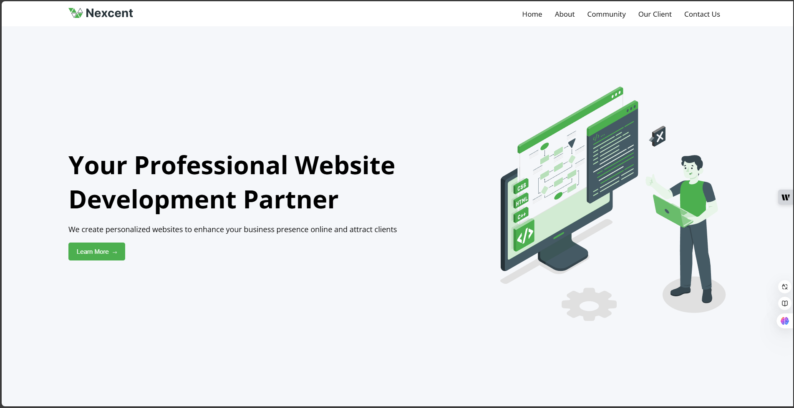
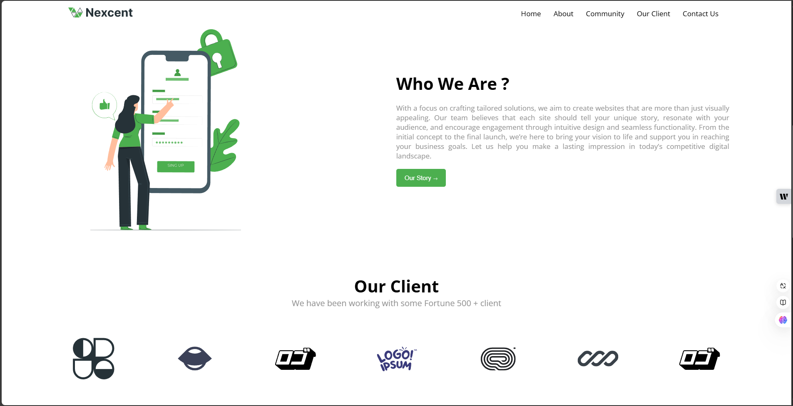
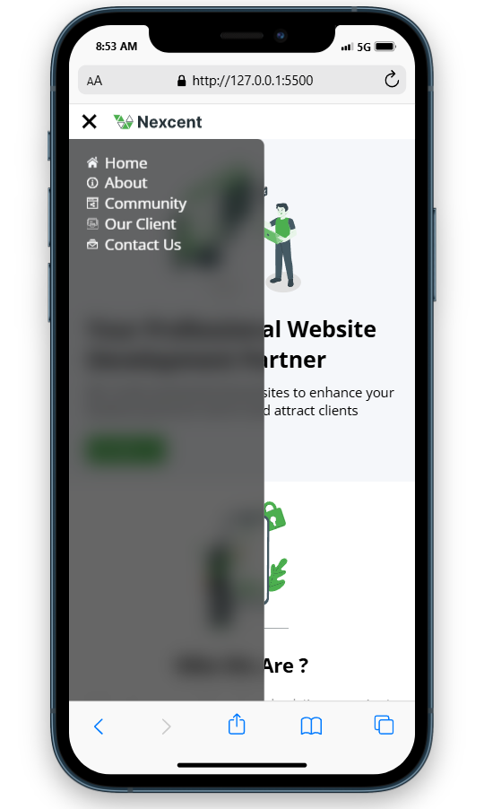

[](https://classroom.github.com/a/f-sXtHED)

# Project Title: Professional Website Development

_Creator: Muhammad Syifa Surya Saputra_

## View the Deployed Website

You can view the live version of the website [here](https://muhammadsyifasurya.github.io/Nexcent/).

## Overview

This project is a responsive website featuring a modern design that showcases a variety of sections including a fixed navbar, a hero section, an about section, community details, and a contact form. The site is built with HTML and styled with CSS to ensure a seamless user experience across devices.

## Features

- **Responsive Design**: Adapts to different screen sizes using media queries.
- **Smooth Scrolling**: Enhances navigation experience.
- **Interactive Elements**: Buttons and navigation items include hover effects for user engagement.

## Future Improvements

- **Tablet Optimization**: Enhancing the website's display on tablet devices to ensure better accessibility and user experience.
- **Performance Enhancements**: Implementing strategies to improve loading times and overall site performance.
- **User Feedback Integration**: Collecting and applying user feedback to inform updates and enhancements.

## Technologies Used

- **HTML5**: For semantic structure and accessibility.
- **CSS3**: To style the website and ensure responsive design.
- **JavaScript**: For added interactivity and dynamic elements.
- **Git/GitHub**: Version control and project management.
- **Visual Studio Code**: Primary code editor used for development.

## CSS Structure

### Global Styles

- **Reset Styles**: Removes default margin and padding for all elements to create a consistent look.
- **Font Family**: Applies "Open Sans" for readability.
- **Scroll Behavior**: Smooth scrolling is enabled for improved navigation.

### Navbar

- **Fixed Positioning**: The navbar remains fixed at the top, ensuring easy access.
- **Flexbox Layout**: Utilizes flexbox for alignment and spacing of items.
- **Hamburger Menu**: Displays a responsive toggle for smaller screens, transitioning between open and closed states.

### Hero Section

- **Background Color**: A soft gray (`#f5f7fa`) enhances visibility.
- **Flexbox Layout**: Centers content both horizontally and vertically.
- **Image Styling**: Includes responsive adjustments for images.

### About Section

- **Flexbox Alignment**: Centers content alongside images for a balanced layout.

### Community Section

- **Grid Layout**: Displays community information in a flexible grid system for better organization.

### Our Client Section

- **Responsive**: Adjusts layout for various screen sizes using flexbox and appropriate padding.
- **Image Slider**: Displays client logos in a horizontal slider with flowing animation, enhancing user interaction.
- **Hover Effects**: Animation pauses on hover, improving user experience.
- **Organized Layout**: Allows for balanced spacing and effective arrangement of elements with consistent margins.

### Contact Section

- **Card Layout**: Information and forms are displayed within rounded cards for a modern look.
- **Input Fields**: Styled for usability with transitions on focus.

### Button Styles

- **Hover Effects**: Buttons feature animations on hover, enhancing interactivity.
- **Custom Shape and Color**: Rounded corners and gradient backgrounds are used for aesthetic appeal.

## Responsive Design

Media queries adjust styles based on screen size, ensuring optimal user experience on mobile and desktop devices.

### Breakpoints

- **Mobile Styles**: Adjustments made at `max-width: 768px` for better usability on smaller screens.

## Semantic HTML Implementation

The project uses Semantic HTML to improve website accessibility and SEO. HTML5 elements like `<header>`, `<nav>`, `<main>`, `<section>`, and `<footer>` provide a clear document structure for both users and search engines. This approach improves readability, allows screen readers to interpret the content more effectively, and enhances inclusivity.



## About


This section provides an overview of the company and its mission, engaging users with relevant information.

## Contact


This section provides various ways to get in touch, enhancing user engagement and support.

## Sidebar (Mobile View)



This image demonstrates the sidebar's appearance in mobile view, ensuring a user-friendly experience across devices.

## Conclusion

This project demonstrates the integration of responsive design principles with modern CSS techniques, providing a user-friendly interface. The layout is flexible and designed to maintain functionality across various devices.

## Installation

To get this project running on your local machine, follow these steps:

**Clone the Repository**  
Use the following command to clone the repository:

```bash
git clone https://github.com/Muhammadsyifasurya/Nexcent.git
```

## Connect with Me

<div style="display: flex; flex-direction: column; gap: 10px; align-items: flex-start;">
  <a href="https://www.linkedin.com/in/muhammadsyifasuryasaputra/" target="_blank" style="text-decoration: none; display: flex; align-items: center;">
    
    <span style="font-size: 16px; color: #0077B5;">Muhammad Syifa Surya Saputra</span>
  </a>
  <a href="https://www.instagram.com/muhammadsyifasurya/" target="_blank" style="text-decoration: none; display: flex; align-items: center;">
    
    <span style="font-size: 16px; color: #C13584;">Muhammad Syifa Surya Saputra</span>
  </a>
</div>
<br>

**Front-End Web Developer | Passionate about clean code and innovative design.**  
Feel free to reach out for collaboration or feedback!
