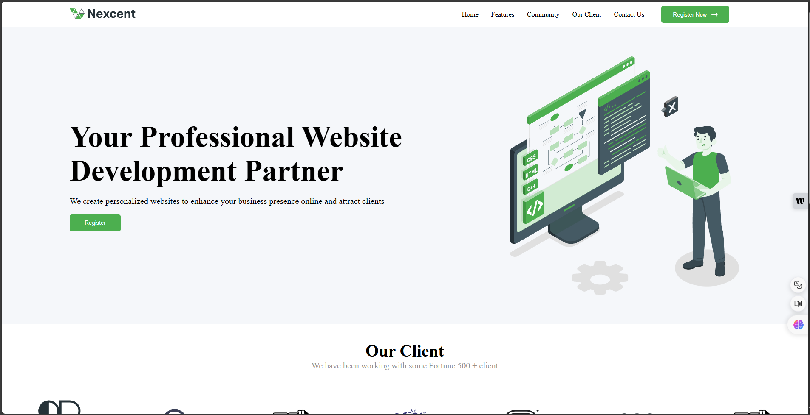

# Project Title: Professional Website Development

_Creator: Muhammad Syifa Surya Saputra_

## Overview

This project showcases a professional website developed for enhancing business presence online. It includes a responsive design and user-friendly navigation, tailored to attract clients. However, the website is not yet optimized for mobile display.

## Features

- **Responsive Design**: The website adapts seamlessly to various screen sizes, ensuring a great user experience on both desktop and mobile devices. (Note: Mobile optimization is still in progress.)
- **User-Friendly Navigation**: A well-structured navigation bar allows users to easily access different sections of the site.
- **Client Showcase**: Displays logos of notable clients to build credibility and trust.

## Semantic HTML Implementation

This project employs Semantic HTML, which enhances the accessibility and SEO of the website. By using appropriate HTML5 elements such as `<header>`, `<nav>`, `<main>`, `<section>`, and `<footer>`, the structure of the document becomes clearer for both users and search engines. This not only improves readability but also helps screen readers interpret the content more effectively, making the website more inclusive.

## Conclusion

This project reflects my commitment to delivering high-quality websites that meet client needs and enhance their online presence while adhering to best practices in web development. Ongoing improvements will focus on mobile optimization to ensure a seamless user experience across all devices.
