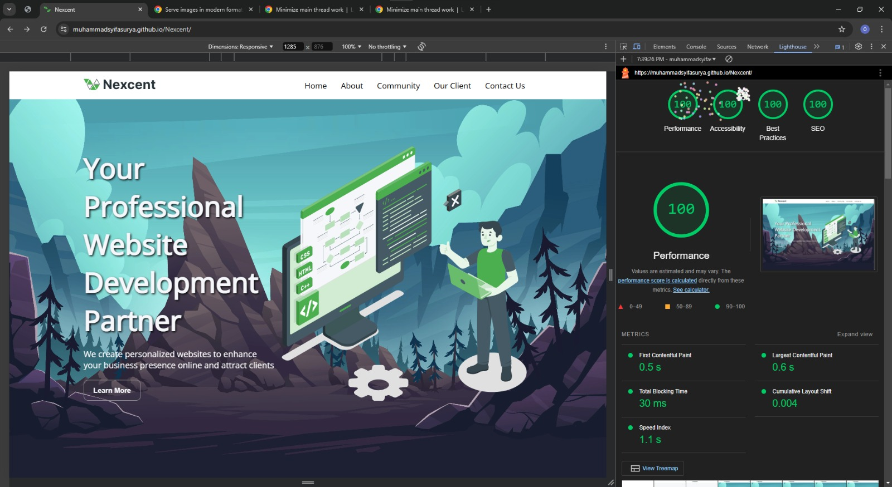

[](https://classroom.github.com/a/f-sXtHED)

# Hello, I'm Muhammad Syifa Surya Saputra 👋

As a Front-End Developer with a strong passion for Software Engineering, I focus on creating visually appealing and highly functional digital experiences. My work emphasizes the use of cutting-edge web technologies to deliver user-centered solutions. Through this website, I share my projects, as well as valuable insights and knowledge in the field. I am always open to new collaborations and connections, so please feel free to reach out to me through the contact options below :

- **Email**: syifamuhammad3139@example.com
- **LinkedIn**: [LinkedIn Profile](https://www.linkedin.com/in/muhammadsyifasuryasaputra/)
- **GitHub**: [GitHub Profile](https://github.com/Muhammadsyifasurya)

---

## 🌐 About This Website

This project is a responsive website featuring a modern design that showcases a variety of sections including a fixed navbar, a hero section, an about section, community details, and a contact form. The site is built with HTML and styled with CSS to ensure a seamless user experience across devices. [View the live version here](https://stilllearning.site/)

## 📑 Website Structure

1. **Home**: Main landing page showcasing the hero section with key features.
2. **About**: Information on the projects I’ve worked on.
3. **Our Clients**: A closer look at the clients and success stories.
4. **Community**: A celebration of our growing community with over 2 million members, 46k+ clubs, and numerous events and payments.
5. **Contact Us**: Get in touch with me for questions and collaborations.

## 🔧 Tools Used

A list of tools and technologies used to build this site, such as:

- **Framework** : Nothing
- **Library** : Tailwind CSS
- **Hosting Platform** : Netlify

## 🛠️ Technologies Used

- **HTML5**: For semantic structure and accessibility.
- **CSS3**: To style the website and ensure responsive design.
- **JavaScript**: For added interactivity and dynamic elements.
- **Git/GitHub**: Version control and project management.
- **Visual Studio Code**: Primary code editor used for development.

## 📝 Semantic HTML Implementation

- **`<header>`**: Defines the top section of the page, often containing navigation and introductory content.
- **`<nav>`**: Marks the navigation links or menu, enhancing site structure.
- **`<main>`**: Represents the main content of the document, separate from other parts like headers or footers.
- **`<section>`**: Groups related content, making it easier to organize and understand.
- **`<footer>`**: Specifies footer information, like copyright or contact details, for better structure.

## 🎨 CSS Structure

- **Reset Styles**: Removed default margin/padding, ensuring consistency across elements.
- **Font Family**: Used "Open Sans" for readability with `@font-face`.
- **Scroll Behavior**: Enabled smooth scrolling for better navigation.
- **Fixed Positioning**: Navbar stays at the top for easy access.
- **Flexbox Layout**: Used for alignment, spacing, and responsive design.
- **Hamburger Menu**: Added a responsive toggle for smaller screens.
- **Parallax Background**: Used for responsive images in the hero section.
- **Grid Layout**: Applied for community and client sections with asymmetry.
- **Image Slider**: Displayed client logos with a horizontal slider.
- **Hover Effects**: Applied to buttons, client logos, and animations.
- **Card Layout**: Contact information displayed within rounded cards.
- **Media Queries**: Ensured responsive layout for mobile (`max-width: 768px`) and tablet (`max-width: 1024px`).

## 🔍 Lighthouse Performance

The website has been tested using Google Lighthouse, and it achieved perfect scores across all categories:

- **Performance**: 100
- **Accessibility**: 100
- **Best Practices**: 100
- **SEO**: 100

This ensures that the website is fast, accessible, follows best practices, and is optimized for search engines.



## ⚙️ Installation

To get this project running on your local machine, follow these steps:

1. **Clone the Repository**  
   Use the following command to clone the repository:

   ```bash
   git clone https://github.com/Muhammadsyifasurya/Nexcent.git
   ```

2. **Enter to the folder**

   ```bash
   cd Nexcent
   ```

3. **Open with Visual Studio Code**

   ```bash
   code .
   ```

## 🚀 Deployment Documentation

### 1. Registering and Setting Up Netlify


- **Register on Netlify**
- Visit [Netlify](https://www.netlify.com/) to create a new account.
- After registration, log in to your Netlify account.

### 2. Connecting Netlify to the GitHub Project


- **Deploying from GitHub**
- In the Netlify dashboard, click **Add New Site** > **Import an Existing Project**.
- Select **GitHub** as the source, authorize Netlify to access your GitHub account.
- Choose the repository to deploy and set the `main` branch as the auto-deployment source.
- Click **Deploy** to start the process.

### 3. Purchasing and Connecting a Domain to Netlify

#### a. Purchasing a Domain


- Purchase a domain from a provider like [Niagahoster](https://www.niagahoster.co.id/).
- In the Niagahoster dashboard, go to **Domain** > **Search & Check Domain**.
- Enter your desired domain, click **Check Now**, and select your custom domain.

#### b. Connecting the Domain to Netlify


- In Netlify, navigate to **Site Settings** > **Domain Management** > **Add a Domain**.
- Enter the purchased domain and verify it.

#### 3. Updating DNS Nameservers


- Copy the DNS nameservers provided by Netlify.
- Go back to Niagahoster, select **Manage** for your domain, and update the nameservers.
- Wait for the DNS changes to propagate. Your site will be accessible via your custom domain once completed.

### 4. Summary

- **Netlify**: Registration and auto-deployment setup completed.
- **GitHub**: GitHub repository connected for continuous deployment on Netlify.
- **Domain**: Custom domain purchased and DNS settings configured for Netlify.

---
